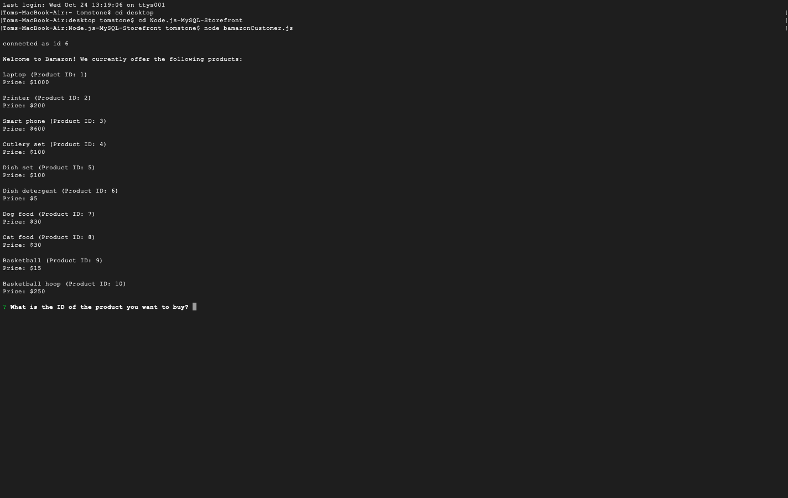

# Node.js-MySQL-Storefront

This application uses Node.js (with MySQL and Inquirer) to create an electronic storefront. It allows the user to purchase a specific quantity of products from a few different store categories. If there is a sufficient quantity of the requested product, the program allows the mock order to go through and updates the database accordingly. If not, it lets the user know that there are not enough units in stock.

To use the app, please follow these steps:

1. Download and install Node.js if you do not already have it: https://nodejs.org/en/
2. Download this repository by entering this command in the command line: git clone https://github.com/TomStone76/Node.js-MySQL-Storefront.git
3. Download and install MySQL if you do not already have it: https://www.mysql.com/
4. Open bamazonCustomer.js. On lines 6 through 8, enter your MySQL port, username, and password. Save the file. Make sure your MySQL connection is active.
5. In MySQL, create the "bamazon" database by pasting lines 1 through 14 of the SQL code from storefrontSchema.sql. Populate the database by pasting lines 16 through 44 of the same code.
6. Using the command line, navigate to the Node.js-MySQL-Storefront directory. Then, type the following command: node bamazonCustomer.js

Technologies used: JavaScript, Node.js, Inquirer NPM package, SQL and MySQL

